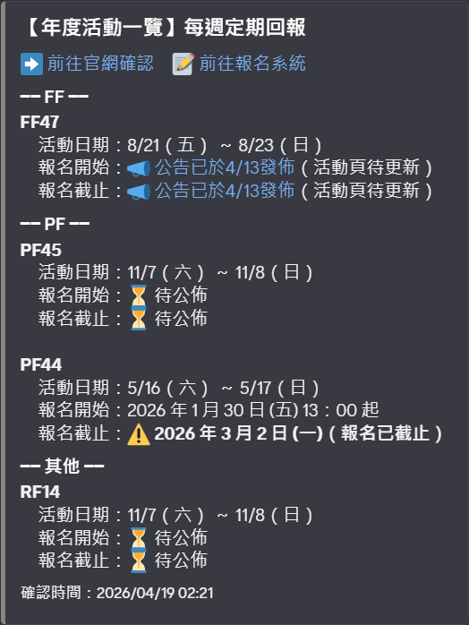
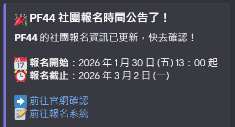
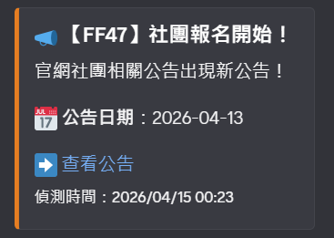

# 開拓動漫祭 社團報名監控腳本

同時監控兩個官方來源，第一時間通知社團報名資訊：

- 📋 **活動頁**：偵測各場次報名時間從「待公佈」變成有實際日期
- 📣 **社團公告頁**：偵測新公告（如「社團報名開始！」）出現

---

## Demo

每天執行後，Discord 頻道會依序收到以下訊息：

**1. 每日靜音確認** — 列出所有場次目前狀態，確認腳本正常運作



**2. 報名公告通知** — 活動頁偵測到「待公佈」變成有實際日期時發送（非靜音）



**3. 社團公告通知** — 社團相關公告頁出現「社團報名開始！」新公告時發送（非靜音）



---

## 檔案結構

```
01_FF_PF_Search/
├── monitor.py        ← 主程式
├── run.bat           ← Windows 排程用啟動檔
├── requirements.txt  ← 套件清單
├── README.md         ← 本說明
├── state.json        ← 自動產生，記錄上次狀態（git 忽略）
└── logs/             ← 自動產生，存放執行紀錄（git 忽略）
    └── monitor.log
```

---

## 步驟 1：安裝套件

```
pip install -r requirements.txt
```

---

## 步驟 2：取得 Discord Webhook URL

1. 打開想接收通知的 Discord **頻道**
2. 點頻道名稱右邊的齒輪（編輯頻道）
3. 左側選「整合」→「Webhook」→「新增 Webhook」
4. 取個名字（例如「報名小助手」），複製 Webhook URL
5. URL 格式：`https://discord.com/api/webhooks/123456789/xxxxxxxxxx`

---

## 步驟 3：設定環境變數

**方法 A：永久生效（推薦）**

在 PowerShell 執行：

```powershell
[System.Environment]::SetEnvironmentVariable(
  'FF_DISCORD_WEBHOOK',
  '你的 Webhook URL',
  'User'
)
```

設定後需重新開啟 cmd / PowerShell 才會生效。

**方法 B：臨時測試**

```
set FF_DISCORD_WEBHOOK=https://discord.com/api/webhooks/你的網址
python monitor.py
```

---

## 步驟 4：手動測試

```
cd 01_FF_PF_Search
python monitor.py
```

成功的話：
- 終端機顯示解析到的場次資訊
- Discord 頻道收到「📋 每日確認：腳本運作中」靜音訊息

---

## 步驟 5：設定 Windows 工作排程器（每天自動執行）

1. 搜尋「工作排程器」並開啟
2. 右側點「建立基本工作」
3. 名稱：`FF報名監控`
4. 觸發程序：「每天」，建議設定早上 9:00
5. 動作：「啟動程式」
6. 程式/指令碼：`run.bat` 的完整路徑
7. 起始位置：`run.bat` 所在資料夾路徑
8. 完成後右鍵該工作 → 「執行」做一次測試

---

## 通知說明

| 情況 | Discord 收到 |
|------|-------------|
| 活動頁報名時間從「待公佈」變成有日期 | 🎉 大通知（非靜音） |
| 社團公告頁出現「社團報名開始！」新公告 | 📣 公告通知（非靜音） |
| 每次腳本執行（每天） | 📋 靜音確認訊息（不發出聲音） |
| 首次執行偵測到場次 | 靜默記錄，不發通知 |

---

## 進階設定

**不想每天收到確認訊息**

在 `monitor.py` 末尾將以下這行加上 `#` 註解掉：

```python
# send_discord_heartbeat(current)
```

**顯示已結束場次**

在 `monitor.py` 頂端將：

```python
SHOW_ENDED = False
```

改為：

```python
SHOW_ENDED = True
```

---

## 注意事項

- 排程執行時電腦須開著（或在工作排程器中勾選「喚醒電腦以執行此工作」）
- 執行紀錄存在 `logs/monitor.log`，可用記事本查看
- `state.json` 存放上次偵測到的狀態，刪除後下次執行會重新建立（不會重複發通知）
